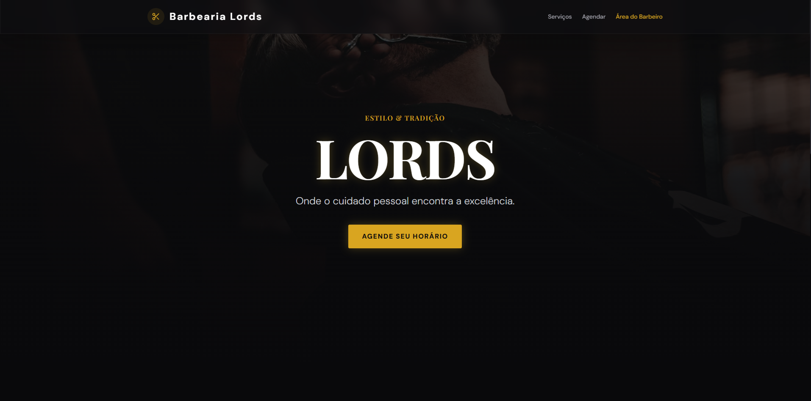

Sistema de Agendamento - Barbearia Lords

Status do Projeto: Deploy realizado com sucesso.

Sistema Full-stack para gestão de agendamentos em barbearias, desenvolvido com foco em experiência do usuário (UX), performance e integridade de dados.

Tecnologias e Ferramentas
O projeto utiliza uma stack moderna e tipada para garantir escalabilidade:
Frontend: React.js, Tailwind CSS e Framer Motion.
Backend: Node.js e Express.

Linguagem: TypeScript (96% da base de código).
Validação de Dados: Zod.
Infraestrutura: Git para controle de versionamento e deploy automatizado.

Funcionalidades Principais
Agendamento Inteligente: Lógica de negócio aplicada para impedir agendamentos fora do horário de expediente ou em períodos de conflito.
Interface Responsiva: Arquitetura de UI adaptada para garantir navegação fluida tanto em dispositivos móveis quanto em desktops.
Painel Administrativo: Área dedicada para a visualização e gestão do fluxo de agendamentos em tempo real.

Arquitetura e Organização
Este projeto segue uma estrutura modular, aplicando princípios fundamentais de Engenharia de Software para facilitar a manutenção e escalabilidade:
servidor (Back-end): Contém a lógica de servidor, gerenciamento de rotas da API e scripts de execução.
compartilhado: Camada de compartilhamento de tipos e esquemas de validação (Zod), garantindo consistência técnica entre cliente e servidor.
src (Front-end): Diretório principal do código-fonte da interface, organizado em componentes reutilizáveis.
Nota Técnica: A organização do repositório foi baseada no princípio de Separação de Responsabilidades (SoC), visando um software desacoplado e de fácil manutenção conforme as melhores práticas de mercado.

